# VoxelBasic Docs

## World Generation — Function Call Hierarchy

- Mermaid (Markdown) version: [world-generation-call-graph.md](./world-generation-call-graph.md)
- SVG (light background): [world-generation-call-graph.svg](./world-generation-call-graph.svg)
- SVG (dark colorful): [world-generation-call-graph-dark.svg](./world-generation-call-graph-dark.svg)

### Preview (Dark Colorful)

  

