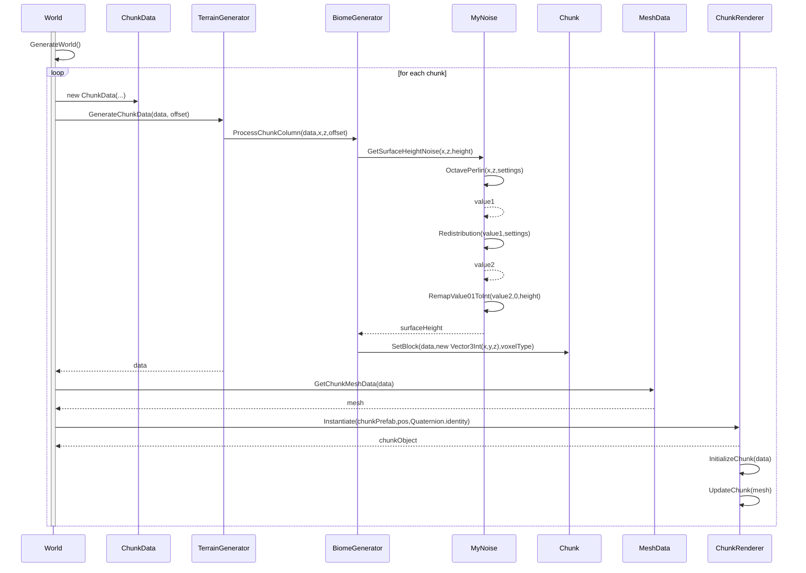

```mermaid
sequenceDiagram
    participant W as World
    participant CH as ChunkData
    participant TG as TerrainGenerator
    participant BG as BiomeGenerator
    participant MN as MyNoise
    participant C as Chunk
    participant MD as MeshData
    participant CR as ChunkRenderer

    activate W
    W->>W: GenerateWorld()

    loop for each chunk
        W->>CH: new ChunkData(...)
        W->>TG: GenerateChunkData(data, offset)
        TG->>BG: ProcessChunkColumn(data,x,z,offset)
        BG->>MN: GetSurfaceHeightNoise(x,z,height)
        MN->>MN: OctavePerlin(x,z,settings)
        MN-->>MN: value1
        MN->>MN: Redistribution(value1,settings)
        MN-->>MN: value2
        MN->>MN: RemapValue01ToInt(value2,0,height)
        MN-->>BG: surfaceHeight
        BG->>C: SetBlock(data,new Vector3Int(x,y,z),voxelType)
        TG-->>W: data
        W->>MD: GetChunkMeshData(data)
        MD-->>W: mesh
        W->>CR: Instantiate(chunkPrefab,pos,Quaternion.identity)
        CR-->>W: chunkObject
        CR->>CR: InitializeChunk(data)
        CR->>CR: UpdateChunk(mesh)
    end

    deactivate W
```
