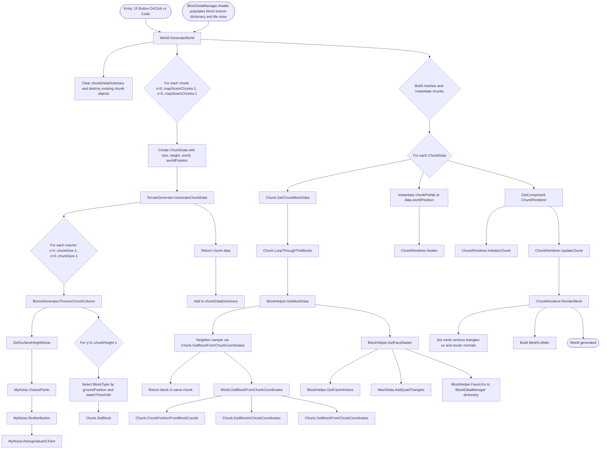

# World Generation — Function Call Hierarchy

This diagram traces the call flow from the first function invocation that triggers world generation through to completion, based on the current project scripts.

Notes:
- Entry: GenerateWorld is not called in Start or Awake in World.cs; it appears to be invoked via UI Button (OnClick) per project docs. The flow assumes World.GenerateWorld as the entry.
- Completion: Generation is synchronous; once the final ChunkRenderer.UpdateChunk finishes, meshes and colliders are set and the world is ready.
- Dependencies: BlockDataManager.Awake should execute earlier in the scene to populate texture data for BlockHelper when building faces.
